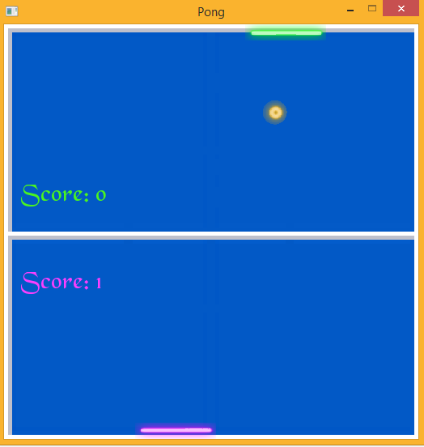

# Pong
A clone of the popular game Pong, written in C++ using SFML.

## Controls
* Use <kbd>A</kbd> & <kbd>D</kbd> and the <kbd>&larr;</kbd> & <kbd>&rarr;</kbd> cursor keys to control the paddle.

### Screenshot

